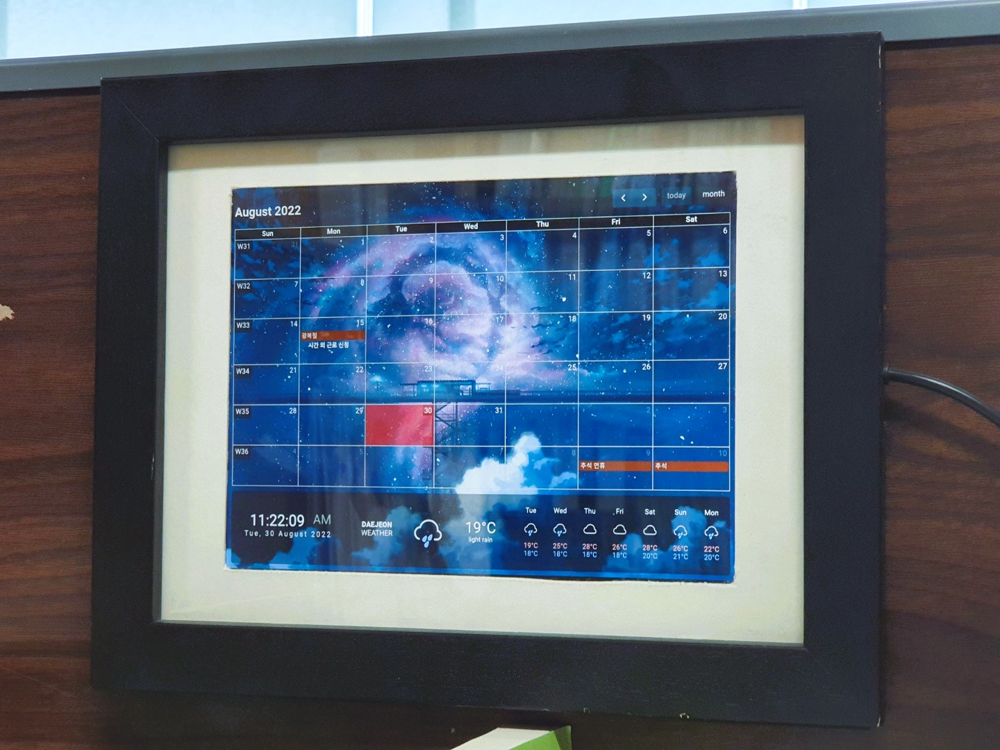

# 태블릿 액자용 HTML 파일
개인 용도로 사용 하는 파일 입니다.   
소스들의 출처가 분명하지 않고, 코드가 지져분 합니다.

## 사용 중인 화면
<center></img></center>

## 사용한 소스들
- [FullCalendar](https://fullcalendar.io/)
- [WeatherWidget.io](https://weatherwidget.io/)
- Google에서 찾은 배경 이미지들..
- Youtube에서 찾은 Countdown sound (5초)

## 사용한 장비

- 테블릿 (미패드2 중고로 5만원 구입(2020년 쯤..))
- 액자 : 네이버에서 액자 파는 곳 어딘가에서 구매 (2만원 미만.)
- 나머지 고정은 다이소에서 파는 찍찍이..

## 사용법

**1. 소리 알림 설정 (index.html; line 9)**

- 현재는 11, 12, 17시 59분 50초에 소리 재생 되게 되어 있음.

```
<script>
	var audio = new Audio('audio/5sec.mp3'); // 소리 파일
    var id =setInterval(function () {
    var hr = new Date().getHours();
		var min = new Date().getMinutes();
		var sec = new Date().getSeconds();
        if (min==59){   //myDate.getHours();    //       (0-23) 
            if (hr==11 && sec==50)
            {
              //console.log('   ',new Date().getHours());
              audio.play();
              //clearInterval(id);
            }
            if (hr==12 && sec==50)
            {
              //console.log('   ',new Date().getHours());
              audio.play();
              //clearInterval(id);
            }
            if (hr==17 && sec==50)
            {
              //console.log('   ',new Date().getHours());
              audio.play();
              //clearInterval(id);
            }
        }
    },1000,id)
</script>
```

**2. 한시간 마다 페이지 새로 고침 (index.html, line 37)**

- 구글 스케쥴 연동 시 한시간 마다 새로 고침 하도록 함.

```
<script>
  setInterval((() => {
    const lastMinute = new Date().getHours();
    return () => {
      const newMinute = new Date().getHours();
      if (newMinute !== lastMinute) location.reload();
    }
  })(), 1000);
</script>
```

**3. Fullcalendar setting (index.html; line 46)**

 - 자세한 setting은 Fullcalendar 홈페이지 참고 부탁 드립니다.

```
<script>

  document.addEventListener('DOMContentLoaded', function() {
    var calendarEl = document.getElementById('calendar');

    var calendar = new FullCalendar.Calendar(calendarEl, {
      weekNumbers: true,

      headerToolbar: {
        left: 'title',
        center: '',
        right: 'prev,next today dayGridMonth'
      },

      displayEventTime: false, // don't show the time column in list view

      googleCalendarApiKey: '[Google API KEY]', // 구글 API KEY
      eventSources: [
        {
          googleCalendarId: 'ko.south_korea#holiday@group.v.calendar.google.com', // 구글 캘린더 아이디 [휴일]
          color: '#713611'
        },
        {
          googleCalendarId: 'YOUR GOOGLE ID @gmail.com', // 구글 아이디
          className: 'nice-event',
          color: '#1B4D6D'
        }
      ],

      eventClick: function(arg) {
        // opens events in a popup window
        window.open(arg.event.url, 'google-calendar-event', 'width=700,height=600');

        arg.jsEvent.preventDefault() // don't navigate in main tab
      },

      loading: function(bool) {
        document.getElementById('loading').style.display =
          bool ? 'block' : 'none';
      }

    });

    calendar.render();
  });

</script>
```